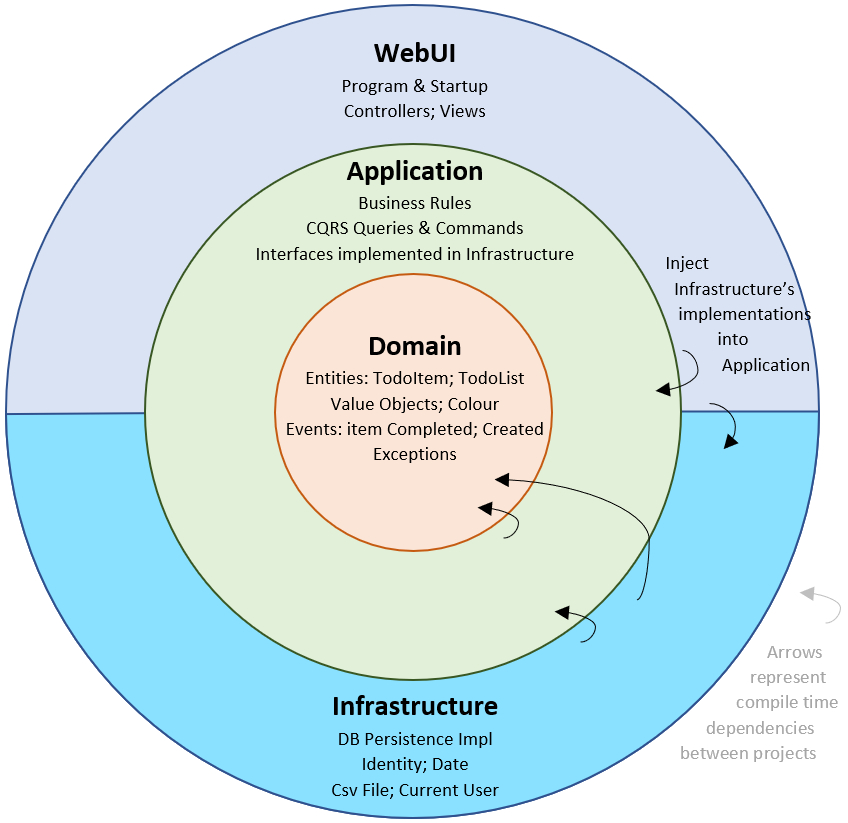

# Clean Architecture template
A **Clean Architecture** approach to design better applications.



## Overview
This is a demonstration application solution built following **Clean Architecture** principles. In essence, it aims to be a proper and accurate reference for new projects.

In **Clean Architecture**, the dependency rule dictates that projects must point inward. All layers reference inward towards the **Domain** layer.


## Understanding the Diagram
I've included this image as a visual reminder of how **Clean Architecture** theoretically appears. In the following sections, I'll explain each layer in simpler terms.

### Core Business Entities
This forms the core of the architecture. You use this layer to encapsulate all **business-wide rules**. In this 
document and template, I refer to it as the **Core** layer.
Don't let the term **"Entities"** cause confusion. In a large enterprise solution, they encapsulate business rules. 
Initially, they might seem like models with some logic. However, for single applications, **Entities** are business 
objects that still encapsulate business rules and are generally stable.


### Application Logic (Use Cases)
This layer acts as an **orchestrator**, wrapping the **Entities (Core)** layer. While we call it "Use Cases" in this 
template, it's often referred to as the **"Application"** layer. It's where all application logic resides.

Changes in this layer should not impact the **Entities**. Similarly, modifications in other layers should not affect 
the **Use Cases** either.

### Interface Adapters (Controllers, Gateways, Presenters)
Consider this layer the primary **entry point** for your application. API endpoints are defined here, and it's also 
responsible for mapping data structures.
In this template, we designate this layer as **Presentation**.
 
We leverage this layer as a gateway to transform data 
from the format required by the **Use Cases** and **Core Business Entities** into the format necessary for external 
systems, such as databases or user interfaces.

### Frameworks and Drivers
This constitutes the outermost layer in the **Clean Architecture** paradigm. It's the designated place for all the 
software's specific **technical details**. The design intent here is to create an environment where these "details" can 
cause minimal or no disruption.


The "details" alluded to in this layer also encompass the concrete implementations of your **Command** (mutation) 
interfaces, which are defined within the **Core Business Entities** layer.


In this template, we named this layer **Infrastructure**.

> Note: As explained by Uncle Bob, the Web/UI is also considered a detail and, according to Clean Architecture 
> principles, it should be kept on the outside. 

## Project Structure Overview
The organizational structure of this project template is founded upon the **Clean Architecture** methodology, 
unequivocally one of the most widely embraced approaches for structuring software solutions.


Below, you'll find the responsibilities assigned to each conceptual layer. It's important to remember these are 
architectural layers, _not_ necessarily distinct .csproj projects.


### Core (also known Domain)
The **Core** or **Domain** layer forms the base of the Clean Architecture. It encapsulates all the fundamental 
**business logics**, **Entities** and **Aggregates**.

An *Aggregate* is a collection of **Entities** that are intended to change together.Therefore, Entities that are 
mutated together are grouped under *Aggregates*.

>Note: This project is exclusively referenced by the **Infrastructure** and **UseCases** projects and does not 
> establish any references to projects residing in outer layers.
> 
> Its reference by **Infrastructure** is due to the need for domain entities to be populated and utilized by the 
> infrastructure components.

### Application (also known as Use Cases)
The **Application** layer serves as our orchestration layer for the **Domain**. It is positioned immediately 
adjacent to the **Domain** layer, essentially acting as a wrapper around it.

This is the opportune layer for implementing a **Command and Query Responsibility Segregation (CQRS)** approach to 
manage use cases effectively.

You would also place all **Query**-related *interfaces* within this layer.

This layer/project maintains a reference to the **Core** project/layer.

### Infrastructure
As its name implies, this layer assumes responsibility for all external-facing implementations and services, including databases and Web/APIs. All ORM-related implementations, file system interactions, email dispatch, and similar concerns are integral to this layer.

> Please note: This layer references the **Core/Domain** project,  and in certain scenarios, it may also require a 
> reference to the **Use Cases** project.

It's also crucial to highlight that the **Query** interfaces you define in the **Core** project are concretely 
implemented within this layer.

Initially, this layer was configured to leverage **MongoDB EF Core**.

The fundamental **Core** dependency rule mandates that we shield the **Core** layer from any non-domain-specific 
dependencies or third-party libraries. Consequently, I implemented a custom value converter, 
*_CustomObjectIdConverter.cs*, to manage the type conversions and configured the DBContext class to utilize it. 

However, I later discovered that this was somewhat overengineering; the following code snippet achieves the 
same result:

```csharp
HasBsonRepresentation(BsonType.ObjectId);
```

Should you decide against using the MongoDB EF Core package and instead prefer the MongoDB Driver, you'll need to 
consider an alternative configuration using _BsonClassMap.TryRegisterClassMap_ for the ObjectId to ensure seamless serialization/deserialization without having to decorate your domain entities.

```csharp
BsonClassMap.RegisterClassMap<SampleEntity>(map =>
    {
        map.MapIdMember(x => x.Id)
            .SetIdGenerator(StringObjectIdGenerator.Instance)
            .SetSerializer(new StringSerializer(BsonType.ObjectId));
    });
```

Currently, the infrastructure is built upon SQL Database and EF Core.

### Presentation
The **Presentation** layer serves as the primary **entry point** into the project. It is also the designated location 
for the API project. As per Uncle Bob's explanation, data structure mapping operations are performed within this layer.

## Shared
The **Shared** project is not a distinct layer within **Clean Architecture**. Its sole purpose within the solution 
is to encapsulate and provide a home for common utilities, shared elements, and base classes that are not directly related to the domain.
